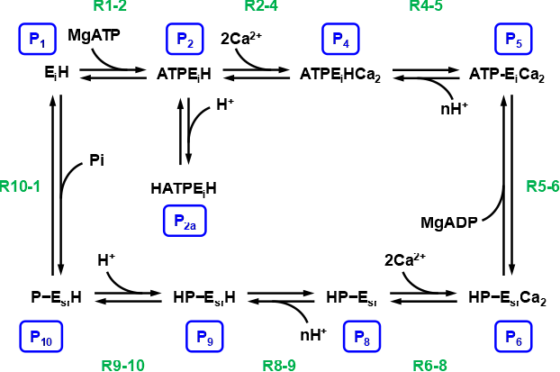

# Examples

Interactive Jupyter Notebook versions of these tutorials can be found on [GitHub](https://github.com/jedforrest/BondGraphsTutorials).

```julia
using BondGraphs
using Catalyst
using Plots
```

## Simple Electric Circuit

This is a reduced copy-and-paste version of the electric circuit tutorial in the [Getting Started](@ref) section.


```@setup circuit
using BondGraphs
using Plots
```

```@example circuit
model = BondGraph("RC Circuit")
C = Component(:C)
R = Component(:R)
Is = Component(:Sf, "Is")
kvl = EqualEffort()

add_node!(model, [C, R, Is, kvl])
connect!(model, R, kvl)
connect!(model, C, kvl)
connect!(model, Is, kvl)

C.C = 1
R.R = 2

u0 = [1]
p = plot()
for i in 1:4
    Is.fs = t -> cos(i * t)
    sol = simulate(model, (0., 5.); u0)
    plot!(p, sol, label = "f(t) = cos($(i)t)", lw=2)
end
plot(p)
```

## Biochemical Reaction Networks
BondGraphs.jl includes a special type conversion from a `Catalyst.ReactionSystem` to a `BondGraph`. This means we can easily create chemical reaction networks with the [`@reaction_network`](https://docs.sciml.ai/Catalyst/stable/api/catalyst_api/#Catalyst.@reaction_network) macro and automatically generate a biochemical bond graph.

```@setup biochemical
using BondGraphs
using Catalyst
using Plots
```

### A simple biochemical example
We will start with a very simple chemical reaction.
```math
A + B \rightleftharpoons C
```
Due to the design of bond graphs, all reactions must be reversible. 

```@example biochemical
abc = @reaction_network ABC begin
    1, A + B --> C
end

bg_abc = BondGraph(abc)
plot(bg_abc)
```

!!! note 
    The `1` before the reaction definition is the reaction rate. This is currently not used in the conversion, so the value is only a placeholder. The reaction rate can be set later in the bond graph. 

This model derives equations for mass-action kinetics. (Other reaction equations can be used with a custom reaction component.)

```@example biochemical
constitutive_relations(bg_abc; sub_defaults=true)
```

```@example biochemical
tspan = (0., 2.)
u0 = [1, 1, 0]
sol = simulate(bg_abc, tspan; u0)
plot(sol, lw=3)
```

### Stoichiometry
This process works with multiple reactions with different stoichiometries.
```math
A + 2B \rightleftharpoons 3C \\
8A + 4C \rightleftharpoons D
```

```@example biochemical
abcd = @reaction_network ABCD begin
    1, A + 2B --> 3C
    1, 8A + 4C --> D
end
bg_abcd = BondGraph(abcd)
plot(bg_abcd)
```

```@example biochemical
constitutive_relations(bg_abcd; sub_defaults=true)
```

```@example biochemical
tspan = (0.0, 0.1)
u0 = [3, 2, 1, 0]
sol = simulate(bg_abcd, tspan; u0)
plot(sol, lw=3)
```

### The reversible Michaelis-Menten model
A realistic example with chemostats. Chemostats are chemical species that are held constant throught the reaction by adding or removing the species to maintian the set concentration.

```math
E + S \rightleftharpoons C \\ 
C \rightleftharpoons E + P
```

Here, the substrate `S` and `P` are chemostats. In bond graph terms, this means replacing the `Ce` components with a `SCe` component.

```@example biochemical
rn_mm = @reaction_network MM_reversible begin
    (1, 1), E + S <--> C
    (1, 1), C <--> E + P
end

bg_mm = BondGraph(rn_mm; chemostats=["S", "P"])

plot(bg_mm, fontsize=12)
```

```@example biochemical
bg_mm.S.xs = t -> 1 + t # substrate increases over time

tspan = (0., 10.)
u0 = [1,2]
sol = simulate(bg_mm, tspan; u0)
plot(sol, lw=3)
```

## SERCA Pump
In this example we will demonstrate biochemical bond graph construction on a larger system.

We will model the SERCA reaction network as described in Tran et al.[^1] and Pan et al.[^2]

[^1]: Tran et al., _A Thermodynamic Model of the Cardiac Sarcoplasmic/Endoplasmic Ca2+ (SERCA) Pump_ (2009)
[^2]: Pan et al., _Bond graph modelling of the cardiac action potential: implications for drift and non-unique steady states_ (2018)



```@setup serca
using BondGraphs
using Catalyst
using Plots
```

```@example serca
rn_serca = @reaction_network SERCA begin
    (1, 1), P1 + MgATP <--> P2
    (1, 1), P2 + H <--> P2a
    (1, 1), P2 + 2Cai <--> P4
    (1, 1), P4 <--> P5 + 2H
    (1, 1), P5 <--> P6 + MgADP
    (1, 1), P6 <--> P8 + 2Casr
    (1, 1), P8 + 2H <--> P9
    (1, 1), P9 <--> P10 + H
    (1, 1), P10 <--> P1 + Pi
end

chemostats = ["MgATP", "MgADP", "Pi", "H", "Cai", "Casr"]
bg_serca = BondGraph(rn_serca; chemostats)
plot(bg_serca, size=(600,600), fontsize=10)
```

For this example we need to set the parameter values for the reaction rates $r$, the species affinities $K$, the chemostat concentrations $x_s$, and the initial concentrations for all $P_i$.

We also set let the calcium concentration increase over time with $[\text{Ca}^{2+}] = 0.05 + 0.01t$

```@example serca
reaction_rates = [
    :R1 => 0.00053004, 
    :R2 => 8326784.0537,
    :R3 => 1567.7476,
    :R4 => 1567.7476,
    :R5 => 3063.4006,
    :R6 => 130852.3839,
    :R7 => 11612934.8748,
    :R8 => 11612934.8748,
    :R9 => 0.049926
]
species_affinities = [
    :P1 => 5263.6085,
    :P2 => 3803.6518,
    :P2a => 3110.4445,
    :P4 => 16520516.1239,
    :P5 => 0.82914,
    :P6 => 993148.433,
    :P8 => 37.7379,
    :P9 => 2230.2717,
    :P10 => 410.6048,
    :Cai => 1.9058,
    :Casr => 31.764,
    :MgATP => 244.3021,
    :MgADP => 5.8126e-7,
    :Pi => 0.014921,
    :H => 1862.5406
]
vol_sr = 2.28
chemostat_amounts = [
    :Cai => t -> 0.0057,
    :Casr => t -> vol_sr*(0.05 + 0.01t), # Ca2+ increases over time
    :H => t -> 0.004028,
    :MgADP => t -> 1.3794,
    :MgATP => t -> 3.8,
    :Pi => t -> 570
]
initial_conditions = [
    :P1 => 0.000483061870385487,
    :P2 => 0.0574915174273067,
    :P2a => 0.527445119834607,
    :P4 => 1.51818391164022e-09,
    :P5 => 0.000521923287622898,
    :P6 => 7.80721128535043e-05,
    :P8 => 0.156693953834181,
    :P9 => 0.149232225342376,
    :P10 => 0.108044124948978
]
for (reaction, rate) in reaction_rates
    getproperty(bg_serca, reaction).r = rate
end
for (species, affinity) in species_affinities
    getproperty(bg_serca, species).K = affinity
end
for (chemostat, amount) in chemostat_amounts
    getproperty(bg_serca, chemostat).xs = amount
end
for (species, ic) in initial_conditions
    getproperty(bg_serca, species).q = ic
end
```

```@example serca
import DifferentialEquations: Rosenbrock23 # stiff equation solver

tspan = (0., 200.)
sol = simulate(bg_serca, tspan; solver=Rosenbrock23());
plot(sol, lw=2, legend=:right)
```

## Electrochemical System: Ion Pore Transport
A multiphysics bond graph example that combines biochemical reactions with electrical (ion) forces. This example is taken from Cudmore et al.[^3]

[^3]: Cudmore et al., _Analysing and simulating energy-based models in biology using BondGraphTools_ (2021)

For this example we are modelling three ion pore channels for $\mathrm{Na}^+$, $\mathrm{Cl}^-$ and $\mathrm{K}^+$. It is a good idea to define a function that returns an ion pore base model.

```@setup iontransport
using BondGraphs
using Plots
```

```@example iontransport
function ion_pore(name=""; z=1, conc_ex=1//1000, conc_in=1//1000)
    bg = BondGraph(name * " Ion Pore Transport")

    membrane = Component(:C, "mem"; C=1)
    ion_ex = Component(:SCe, "Ie"; K=1, xs=t->conc_ex)
    ion_in = Component(:SCe, "Ii"; K=1, xs=t->conc_in)

    potential_mem = EqualEffort()
    flow_f = EqualFlow()
    flow_r = EqualFlow()

    TF_F = Component(:TF, "F"; n=96485)
    TF_zf = Component(:TF, "-z/2"; n=-z//2) # -ve voltage
    TF_zr = Component(:TF, "z/2"; n=z//2) # +ve voltage

    re_pore = Component(:Re, "pore"; r=1//10_000_000)

    allcomps = [
        membrane, ion_ex, ion_in, potential_mem, flow_f, flow_r,
        TF_F, TF_zr, TF_zf, re_pore
    ]

    add_node!(bg, allcomps)
    connect!(bg, ion_ex, flow_f)
    connect!(bg, flow_f, re_pore)
    connect!(bg, re_pore, flow_r)
    connect!(bg, flow_r, ion_in)
    connect!(bg, flow_r, (TF_zr,2))
    connect!(bg, (TF_zr,1), potential_mem)
    connect!(bg, potential_mem, (TF_zf,1))
    connect!(bg, (TF_zf,2), flow_f)
    connect!(bg, potential_mem, (TF_F,2))
    connect!(bg, (TF_F,1), membrane)
    
    return bg
end
ion_pore_bg = ion_pore()
plot(ion_pore_bg)
```

```@example iontransport
ions = [
    "Na" => (z=1, conc_ex=155//1000, conc_in=19//1000),
    "Cl" => (z=-1, conc_ex=112//1000, conc_in=78//1000),
    "K"  => (z=1, conc_ex=5//1000, conc_in=136//1000),
]

plot(; legend=:bottomright)
for (ionname, params) in ions
    model = ion_pore(ionname; params...)
    sol = simulate(model, (0., 1000.))
    plot!(sol, label=ionname, lw=3)
end
plot!(; xlabel="Time [ms]", ylabel="Membrane potential [mV]", yformatter=y->y*1000)
```

## Enzyme Catalysed Reactions
We can create custom reaction components which describe enzyme-catalyzed reaction mechanices, such as the Michaelis-Menten rate law.

!!! warning
    This method of adding custom components will be deprecated in the near future and replaced with a new method.

```@setup enzyme
using BondGraphs
using Catalyst
using Plots
```

New components are constructed using the same dictionary structure as in the default component library. See [`addlibrary!`](@ref) for more details.

```@example enzyme
using ModelingToolkit

t = ModelingToolkit.t_nounits 
@parameters R T r1 r2 k_c e_T
@variables E(t)[1:2] F(t)[1:2] # effort and flow variables

R, T = GlobalScope(R), GlobalScope(T) # no namespace
D = ModelingToolkit.D_nounits

# Custom Michaelis-Mentin reaction component
ReMM = Dict(
    :description => """
    Michaelis-Menten reaction
    r1: Rate of reaction 1
    r2: Rate of reaction 2
    k_c: Affinity of complex relative to free enzyme
    e_T: Total amount of enzyme
    R: Universal Gas Constant
    T: Temperature
    """,
    :numports => 2,
    :variables => Dict(
        :parameters => Dict(
            r1 => 1,
            r2 => 1,
            k_c => 1,
            e_T => 1
        ),
        :globals => Dict(
            R => 8.314,
            T => 310.0
        )
    ),
    :equations => [
        0 ~ F[1] + F[2],
        0 ~ F[1] - e_T*r1*r2*k_c*(exp(E[1]/R/T) - exp(E[2]/R/T)) / (r1*exp(E[1]/R/T) + r2*exp(E[2]/R/T) + k_c*(r1+r2))
    ]
)

# add to component library
addlibrary!(Dict(:ReMM => ReMM))

ReMM[:equations]
```

We will create a bond graph with these new equations.
$$
A \rightleftharpoons B \rightleftharpoons C
$$

```@example enzyme
rn_enzyme = @reaction_network EnzymeNetwork begin
    (1, 1), A <--> B
    (1, 1), B <--> C
end
bg = BondGraph(rn_enzyme)

bg.A.K, bg.B.K, bg.C.K = 1, 1, 1

# Swap mass-action components for new michaelis-menten components
MM1 = Component(:ReMM, "MM1"; r1=100, r2=100)
MM2 = Component(:ReMM, "MM2"; r1=100, r2=100)
swap!(bg, bg.R1, MM1)
swap!(bg, bg.R2, MM2)

plot(bg)
```

```@example enzyme
constitutive_relations(bg; sub_defaults=true)
```

```@example enzyme
sol = simulate(bg, (0., 20.); u0=[200,50,100])
plot(sol, lw=2)
```

